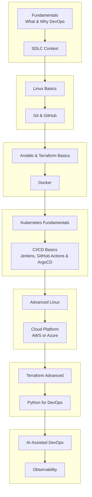

# :material-map: Learning Roadmap

Here you can clearly see the complete strcuctured learning path the course follows, condensed into notes you can revise against. An original roadmap like this evolve yearly folds in **AI-assisted DevOps** and **Observability** as first-class steps for the first time, reflecting what today's job descriptions actually ask for.

!!! warning "IMPORTANT"
    **Total: 3 MONTHS**, at a *minimum* of **2–3 focused hours per day. You should remember that weekend-only study ("2 hours on a Saturday") doesn't get people hired on this timeline. DAILY CONSISTENCY does.**

## Fundamentals of DevOps (~25 days)

!!! warning "Don't skip the prerequisites"
    **A common mistake:** Jumping straight into Linux or Docker without first understanding **What DevOps actually is** and **Where it fits in the software development life cycle (SDLC)**. Skipping this makes every tool you learn afterward harder to contextualize. You'll know *how* without knowing *why*.

### Learning order within this step:

1. **What is DevOps & Why DevOps** - The non-negotiable prerequisite.
2. **DevOps in the SDLC** - How it accelerates software delivery.
3. **Linux fundamentals only** - Not 2–3 months of Linux. Just enough to:
      - Understand why Linux is preferred over Windows for this work
      - Create and SSH into a Linux VM
      - Use the **Top 50 shell commands** DevOps engineers use day-to-day (a very common interview topic)
4. **Git & GitHub** - Version control fundamentals that DevOps engineers use for infrastructure-as-code, not just app code. Pick GitHub specifically(free, has AI features, and the whole open-source ecosystem lives there - a talking point in interviews).
5. **Configuration management basics - Ansible fundamentals only.**
6. **Terraform fundamentals only** - *Not* 30–60 days of Terraform. Terraform depends on knowing a cloud platform's services first, so going deep here is wasted effort.
7. **Containerization - Docker** - What containers are, how they differ from VMs, Docker architecture, networking, volumes/storage, image creation, plus a hands-on container project.
8. **Kubernetes fundamentals** - Architecture, creating a cluster, Pods, Deployments, StatefulSets, DaemonSets, ConfigMaps, Secrets, CRDs, Helm, Kustomize, Ingress, and the Gateway API.
9. **CI/CD basics** - Jenkins + GitHub Actions for CI, ArgoCD for CD (called out as the current in-demand combination for job descriptions).
10. **Advanced Linux** - This is deliberately placed *after* the above, not before: folder structure, log management, process management, memory management, and day-to-day sysadmin tasks DevOps engineers actually do.

!!! tip "Must-have vs. good-to-have"
    Kubernetes especially can become a bottomless rabbit hole. You could study it for a year and still find more. For your first job, learn the **must-have** list above; save deep-dive Kubernetes mastery for *after* you're employed and being paid to learn it.

---

## Step 2 — Pick ONE Cloud Platform (~20–25 days)

=== "If you choose AWS"

    Skip every Azure video in the course. Learning order:

    1. Cloud computing fundamentals (mostly platform-agnostic)
    2. **IAM** — users, roles, permissions (spend real time here — this is
       an ongoing administrative responsibility in the job, not a one-time
       setup task)
    3. **Compute** — EC2, Auto Scaling Groups, Load Balancers, launch templates
    4. **Networking** — VPC, security groups, Route 53
    5. **Storage** — S3
    6. **Databases**
    7. **CI/CD services** on AWS
    8. **Containers** — ECR (registry), ECS, EKS
    9. **Serverless**
    10. **Compliance & security** services, AWS Config
    11. Cloud migration strategies + a real-time AWS project

=== "If you choose Azure"

    Skip every AWS video in the course. The same category order applies:
    fundamentals → IAM → compute → networking → storage → databases →
    CI/CD → containers → serverless → compliance/security → a real-time
    Azure project.

!!! danger "The #1 mistake in this step"
    **Do not complete both AWS and Azure.** Research which one is more in
    demand in your target location, commit to one, and master it. Splitting
    focus across two clouds is the instructor's most repeated warning in
    this roadmap.

---

## Step 3 — Infrastructure as Code: Terraform (~10 days)

You already covered Terraform *fundamentals* in Step 1. This step goes deeper,
now that you understand cloud services well enough for the tool to make sense:

- Providers
- State management & **state locking**
- Provisioners
- Workspaces
- Modules
- Importing existing resources into Terraform
- Vault integration for secrets
- Drift detection

!!! note "Why not Pulumi or Crossplane?"
    Both are gaining traction and the course covers them separately, but for
    your first DevOps role and first round of interviews, **Terraform** is
    still what most companies use and what most interviewers will ask about.

---

## Step 4 — Python for DevOps (~10 days, 16 videos)

Not mastery — just enough Python to automate what shell scripting handles
awkwardly. Suggested order: Python vs. shell (when to use which) → data
types & keywords → functions/modules/packages → CLI arguments & operators →
conditionals → lists/tuples/loops → file management → dictionaries → file
operations → **boto3** (AWS SDK for Python) → three real-time projects you
can describe in interviews and add to your resume.

---

## Step 5 — AI-Assisted DevOps (~10 days, 10–15 videos)

New for 2026 — the instructor frames this as the differentiator that makes
a resume stand out, not a strict must-have.

- AI fundamentals & prompt engineering (zero-shot, multi-shot prompting)
- Your first GenAI project for DevOps
- Running models locally with **Ollama**
- AI-assisted shell scripting
- **AIOps** concepts and an AIOps project
- Building your first AI agent with the **CrewAI** framework
- Docker Model Runner (DMR)
- An internal-documentation AI agent (CrewAI)
- Enterprise AI platforms — setting up an agent in **Retool**

!!! tip "If you're a fresher"
    Even without production experience, being able to say "I know how to
    apply AI to DevOps workflows" is a meaningful interview differentiator.

---

## Step 6 — Observability (~5–6 days, ~10 videos)

!!! info "Why this is no longer optional"
    In prior years, observability was a "good to have." Starting in the
    second half of 2025, most DevOps job descriptions began listing basic
    observability as a requirement — hence its promotion to a full step here.

Covers: **Prometheus**, **Grafana**, the **ELK stack**, **Jaeger**,
**OpenTelemetry**, hands-on projects, and — recently added — **PagerDuty**
(only ~20–30 minutes of content, but worth knowing how on-call paging works
in practice).

---

## Study Cadence

!!! quote "The instructor's honest take"
    Courses + 2–3 hours on weekends only → "leads you nowhere." Whether or
    not you follow a paid course, **2–3 focused hours every day** is the
    actual requirement behind the "3 months" estimate.

| Commitment | Realistic Total Timeline |
|---|---|
| 2–3 hrs/day, daily | ~3 months (as designed) |
| 2–3 hrs, weekends only | Not recommended — the instructor explicitly warns this doesn't work |

---

## Why AI Hasn't Killed DevOps Hiring

A note the instructor makes explicitly: development and testing roles have
seen real reductions from AI/LLM tooling, but DevOps — being fundamentally
an **operations** discipline — has been much less affected so far, since
current large language models are still comparatively weak at operations
work. This is offered as context, not a guarantee — worth treating as one
person's read on the market rather than settled fact.

## Related

- [DevOps Engineering Course](devops-course/index.md) — the day-by-day notes this roadmap maps onto
- [Resources](resources.md) — how to extend the course structure as you add more days
- [About](about.md) — how this site itself is organized